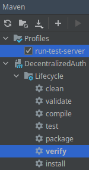

example configuration adding profile **run-test-server**. run maven lifecycle **verify** with profile **run-test-server** to start a local test server.



```xml
<!-- ... -->
<properties>
    <minecraft.version>1.19.1</minecraft.version>
</properties>
<!-- ... -->
<profiles>
<profile>
    <id>run-test-server</id>
    <properties>
        <build.profile.id>run-test-server</build.profile.id>
        <skip.integration.tests>false</skip.integration.tests>
        <skip.unit.tests>false</skip.unit.tests>
    </properties>
    <build>
        <defaultGoal>verify</defaultGoal>
        <plugins>
            <plugin>
                <groupId>org.apache.maven.plugins</groupId>
                <artifactId>maven-clean-plugin</artifactId>
                <version>3.1.0</version>
                <configuration>
                    <filesets>
                        <fileset>
                            <directory>server</directory>
                            <followSymlinks>false</followSymlinks>
                        </fileset>
                    </filesets>
                </configuration>
            </plugin>
            <plugin>
                <groupId>org.codehaus.mojo</groupId>
                <artifactId>exec-maven-plugin</artifactId>
                <version>3.1.0</version>
                <executions>
                    <execution>
                        <id>mc-server-setup</id>
                        <phase>pre-integration-test</phase>
                        <goals>
                            <goal>exec</goal>
                        </goals>
                        <configuration>
                            <executable>${project.basedir}/convenience.sh</executable>
                            <arguments>
                                <argument>-i</argument>
                                <argument>target/${project.artifactId}-${project.version}.jar</argument>
                                <argument>${minecraft.version}</argument>
                            </arguments>
                            <environmentVariables>
                                <!-- Set MC_EULA=true to agree with Mojangs EULA: https://account.mojang.com/documents/minecraft_eula
                                <MC_EULA>true</MC_EULA> -->
                            </environmentVariables>
                        </configuration>
                    </execution>
                    <execution>
                        <id>mc-server-run</id>
                        <phase>integration-test</phase>
                        <goals>
                            <goal>exec</goal>
                        </goals>
                        <configuration>
                            <workingDirectory>server</workingDirectory>
                            <executable>java</executable>
                            <arguments>
                                <argument>-jar</argument>
                                <argument>server.jar</argument>
                                <argument>nogui</argument>
                            </arguments>
                        </configuration>
                    </execution>
                </executions>
                <configuration>
                    <environmentVariables>
                        <LANG>en_US</LANG>
                    </environmentVariables>
                </configuration>
            </plugin>
        </plugins>
    </build>
</profile>
</profiles>
<!-- ... -->
```
